## Using External Services to call Salesforce APIs in Flow

Salesforce introduced <a href="https://trailhead.salesforce.com/en/content/learn/modules/external-services/get-started-with-external-services" target="_blank">External Services</a> a few years ago to enable admins to invoke APIs without having to write Apex code. At a high level, the concept is as follows: The endpoint url and authentication would be defined by a <a href="https://help.salesforce.com/articleView?id=named_credentials_about.htm" target="_blank">Named Credential</a>. The API Schema should be defined in <a href="https://swagger.io/specification/v2/">OAS 2.0</a> format and imported into Salesforce as an “External Service”. Salesforce would generate classes, internally, based on the imported schema, to invoke the API and make them available as <a href="https://developer.salesforce.com/docs/atlas.en-us.api_rest.meta/api_rest/resources_actions_invocable.htm" target="_blank">Invocable Actions</a> in Flows. On paper, this is really great and would open up whole new worlds for admins. However, in practice, this has a few issues. 

Even though OAS schema for defining REST APIs have been around for a while and show a lot of promise (ala, WSDLs in SOAP), their adoption has been lacking. I see a couple of main reasons for this:
* A lack of tools in major IDEs to auto-generate the schema file when building APIs 
* The schema is too complicated to create by hand and can be intimidating to look at, for larger APIs
* It can’t handle dynamic properties and requires that all request and response properties be named. A lot of modern APIs have request and response objects with dynamic schemas, which may not translate well enough to External Services

Consequently, External Services never really took off and don’t seem to be getting much love from the community. However, their potential is very real and can really supercharge Flows, without adding to the amount of code that developers need to write, test and maintain.

When External Services were first released, I had considered the idea of exposing Salesforce API functions via External Services. However, admittedly, I was intimidated by the effort it would take to translate Salesforce APIs to its OAS representations and decided it was not worth the effort and that was that. It’s possible that I might have overlooked something, but I haven’t seen any such efforts from the community at large either. Fast-forward a few years and I now have some <a href="https://www.mulesoft.com/" target="_blank">Mulesoft</a> experience under my belt, defining and building APIs on it, learning a lot in the process and getting certified. The process of building APIs on Mulesoft typically starts with defining their schema using <a href="https://raml.org/" target="_blank">RAML</a>. RAML is a YAML-like markup language created by Mulesoft to define API schemas, as an alternative to OAS. It is a lot easier to create API specs in, easier to understand, and Mulesoft offers tools to convert RAML files to their OAS representation. A discussion over on the <a href="https://sfxd.github.io/" target="_blank">SFXD</a> discord forum the other day had me thinking about External Services again and I was inspired to give it a shot using RAML this time!

So, as it turns out, you CAN use RAML to define the schemas of the Salesforce APIs you’re interested in, convert those to OAS and import into SF! Here are a couple of simple use cases I would like to cover, to illustrate its possibilities.

* **Using REST API to set a User’s password**
* **Using Tooling API to delete Debug Logs and Inactive Flow Versions**
* **Call Lightning Scheduling API to get Appointment Slots**

Before we dive into the examples themselves, we need to define a <a href="https://www.jitendrazaa.com/blog/salesforce/salesforce-to-salesforce-integration-using-named-credentials-in-just-5-lines-of-code/" target="_blank">Named Credential</a> for the current org. While the process would remain the same, I’d like to add a couple of points:
Define the endpoint as "https://<yourinstance.salesforce.com>/services/data/vXX.X" since it is common across most all Salesforce APIs and will help reduce the variable name lengths of External Service’s auto-generated artifacts. There is a limit of <a href="https://help.salesforce.com/articleView?id=enhanced_external_services_considerations.htm&type=5" target="_blank">40 characters</a> on identifier names and so this helps
It could take upto 30 minutes for your Connected App’s client id to be recognized by Salesforce, even though Salesforce says 2-10 minutes.

Alright, onward to the aforementioned use cases now

### Using REST API to set a User’s password

I’m not sure of the real-world applications of this one. Maybe granting a user permission to reset passwords or set temporary passwords for other users, without giving them Delegated Admin permissions. For example, you could identify a `Delegated Admin` for each of your Partner Accounts who can manage passwords for all users for just that Partner. It’s easy to build the checks and balances such a process would take, using standard Flow components. And the External Service can be used to actually set/reset the password.

We will be using the <a href="https://developer.salesforce.com/docs/atlas.en-us.api_rest.meta/api_rest/dome_sobject_user_password.htm" target="_blank">Password Management API</a> for this. The first step is to generate the OAS representation of this API’s schema. This is what the RAML representation of the API schema looks like. Notice that I haven’t built out the whole schema (notably, the response), but just the relevant parts. This greatly simplifies the process of creating RAMLs for the APIs we need..

*A quick side note on building RAMLs here. I create RAMLs by hand on <a href="https://www.mulesoft.com/platform/anypoint-design-center" target="_blank">Mulesoft’s AnyPoint Platform Design Center</a>. You can sign up for a free 30 day-trial of the Anypoint Platform. The trial only applies to the use of their cloud resources and Mule runtime to run and deploy your APIs. The Design Center is forever free to use, which is awesome! Alternatively, there is an <a href="http://mulesoft.github.io/api-designer/" target="_blank">open-source RAML in-browser editor</a> available. I find Mulesoft’s version more user-friendly though. There is a <a href="https://raml.org/developers/raml-100-tutorial" target="_blank">small learning curve</a> as far as RAMLs are concerned, but referring to just one or two will tell you all you need to know to start building your own*. 

Once the [RAML](./assets/artifacts/password-api-raml.yml) is created, the next step (if you are using Anypoint Platform) is to publish it to your private Exchange . You can then download the corresponding OAS schema file from the Exchange. [Here’s what the OAS schema for our Password Management API looks like](./assets/artifacts/password-api-oas.json). And here are some screenshots of our Password Management Flow, for setting a user’s (hopefully, temporary) password.

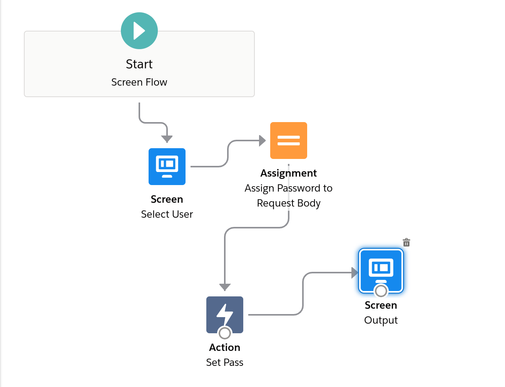
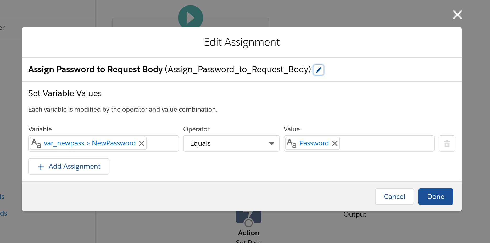
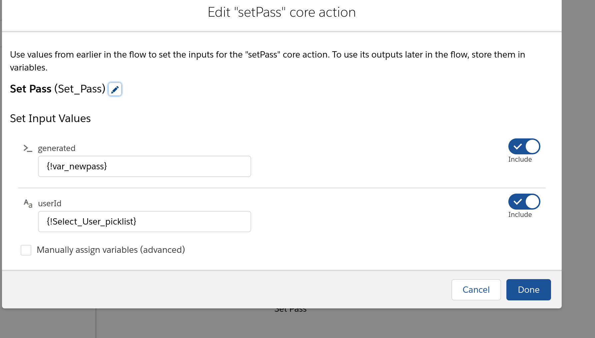

### Using Tooling API to delete Inactive Flow Versions

Deleting inactive Flow versions has always been a pain, with Salesforce lacking a great UI to do so, and requiring multiple clicks to delete each version. Recently, folks over at <a href="https://unofficialsf.com" target="_blank">Unofficial SF</a> have created an <a href="https://unofficialsf.com/flow-and-process-builder-list-view-with-batch-delete/" target="_blank">awesome datatable component</a> to ease the process. Read on to see how we can leverage tooling api for this through flows. 

We will be using the `GET` method on `tooling.query` resource first to retrieve obsolete Flow versions. Then we will loop over the results and call the `DELETE` method on `/tooling/sobject/id` resource for this. The SObject in question is <a href="https://developer.salesforce.com/docs/atlas.en-us.api_tooling.meta/api_tooling/tooling_api_objects_flow.htm" target="_blank">Flow</a>. [This is what the RAML](./assets/artifacts/sf-tooling-api-raml.yml) looks like for the relevant apis in this example. Here are a few screenshots of the flow itself.

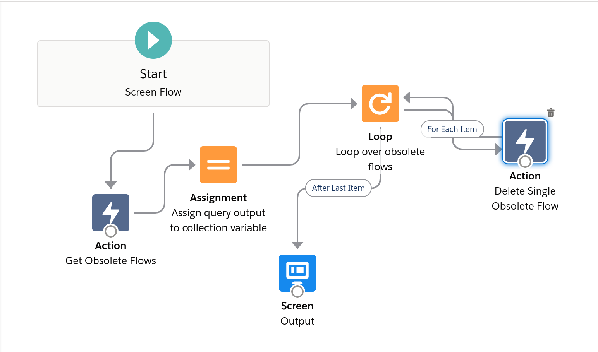
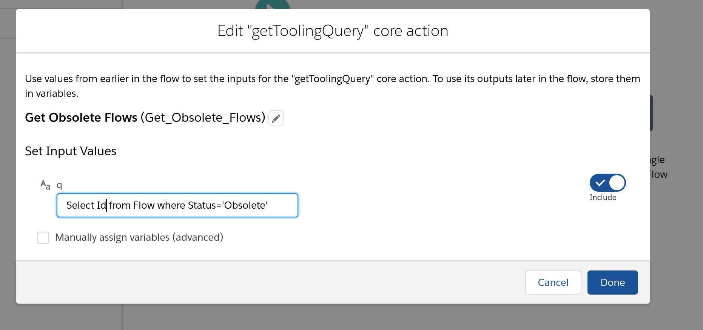
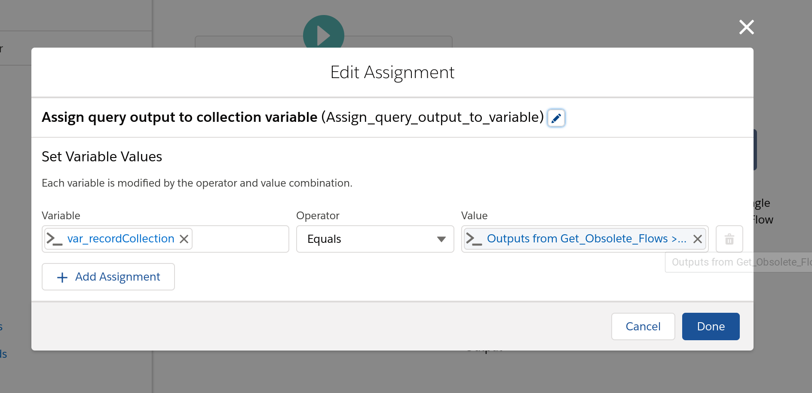
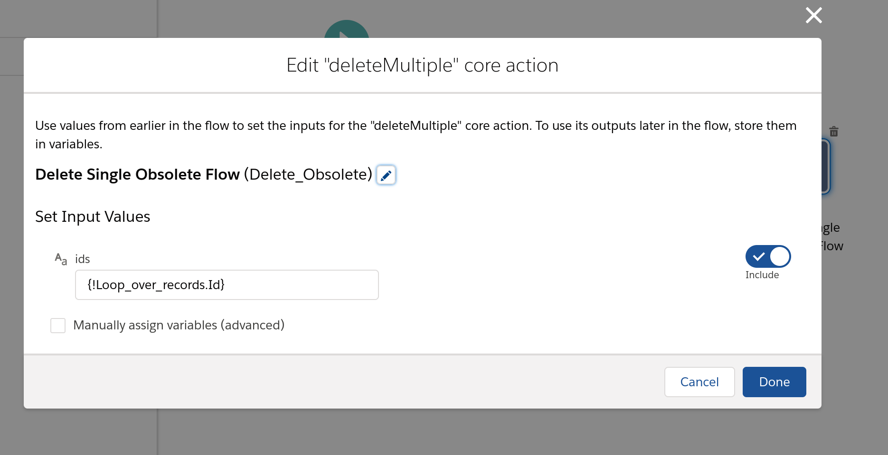

### Call Lightning Scheduling API to get Appointment Slots

<a href="https://developer.salesforce.com/docs/atlas.en-us.api_rest.meta/api_rest/resources_ls_intro.htm" target="_blank">Lightning Scheduler has its own REST APIs</a> that developers frequently end up working with to expand upon standard functionality. Their <a href="https://developer.salesforce.com/docs/atlas.en-us.api_rest.meta/api_rest/requests_ls_getappointmentslots.htm" target="_blank">`getAppointmentSlots`</a> API returns available time slots given  a resourceId, Account Id and Work Type/Group Id. Here’s what the [RAML](./assets/artifacts/scheduling-api-raml.yml) and [OAS](./assets/artifacts/scheduling-api-oas.json) schema files look like for this API. And here are some screenshots of a Flow that gets the available time slots for some hard-coded values of the Account ID, Resource Id and Work Type Id.

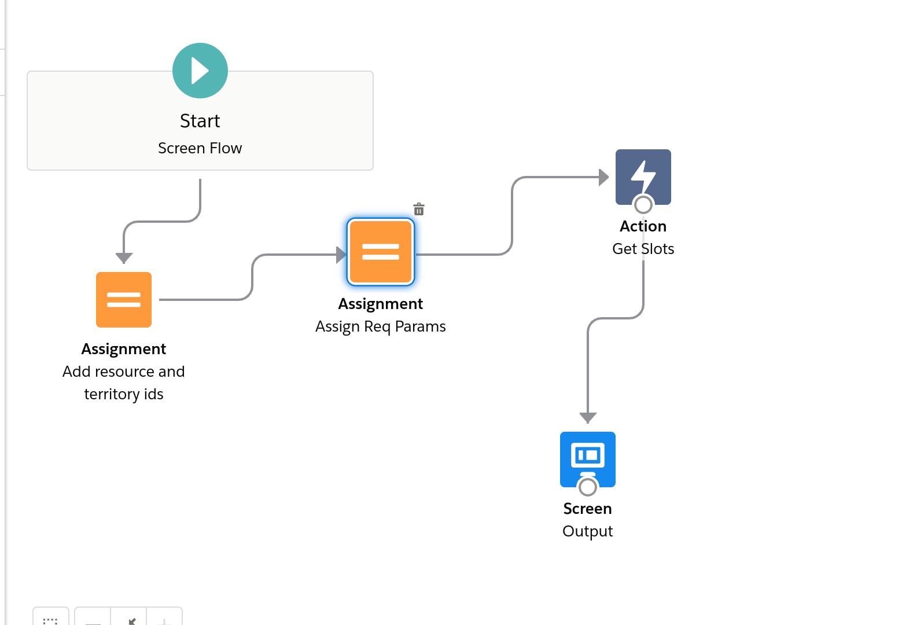
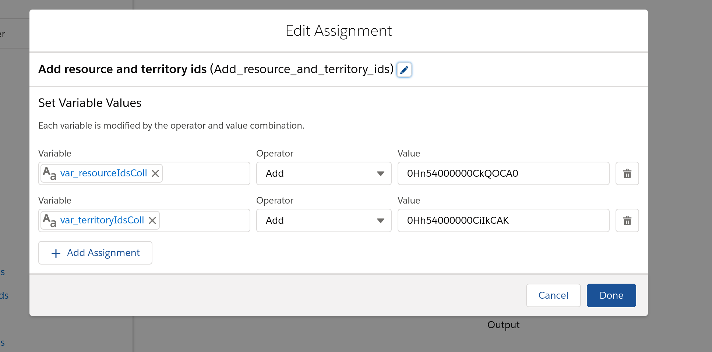
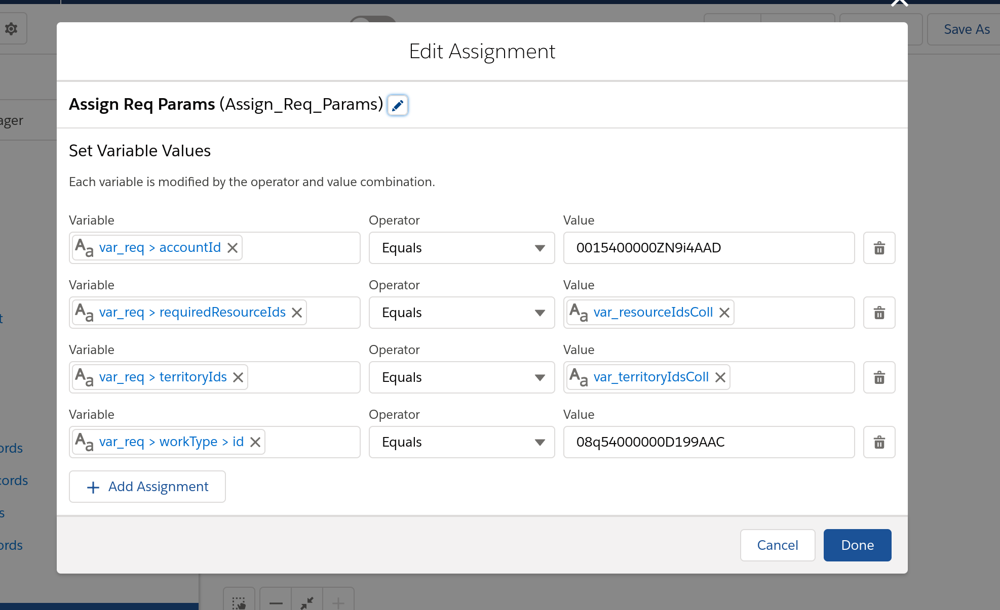
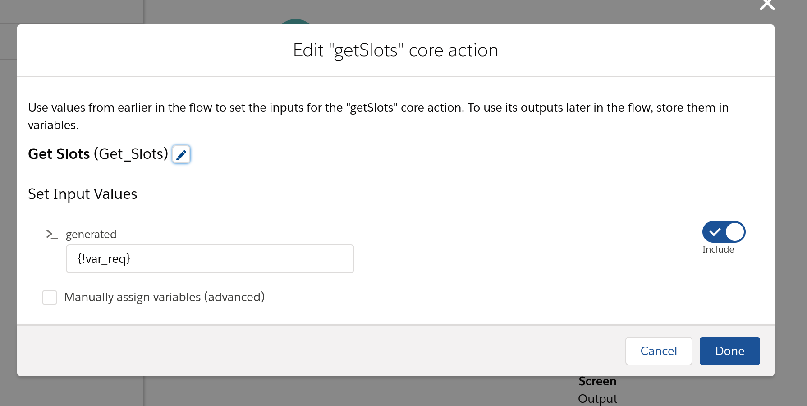

### Closing remarks

RAML can be a very powerful tool allowing both admins and developers to import most REST APIs as External Services into Salesforce. Coupled with the advances that Salesforce has been making in Flows, and the fact that exposing External Services outside Flows is on the Salesforce roadmap, this can greatly reduce the amount of code needed for integrations.
